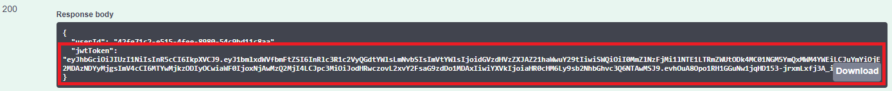
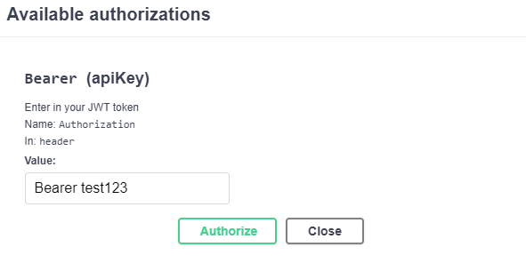
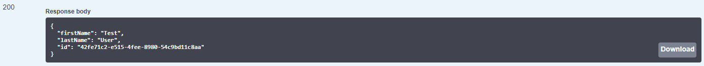

# Bookversity-Backend


Backend for the Bookversity web application. Part of my submission for the Microsoft Student Accelerator 2020 Phase 2 project. Click [here](https://bookversity-backend.azurewebsites.net/) to view the backend API via Swagger.

# Intro
Bookversity (yes, not the greatest name, pls don't roast <3) is a simple web platform I built dedicated to facilitate the selling of second-hand university textbooks. This is the backend of the project, you can find the frontend [here](https://github.com/marknzl/bookversity-frontend). This backend is written in C# using the ASP.NET Core framework. This project utilizes CI/CD pipelines via Azure DevOps.

# Advanced features integrated:
- Custom Image Store service using Azure Blob Storage
- Authentication via ASP.NET Core Identity & Authorization via JWT tokens
- Realtime updates via SignalR
- Mobile-first responsive UI
- Relational database with relationships between tables

## Calling API endpoints via Swagger
In order to access majority of API endpoints, you first need to authenticate and retrieve your JWT token which you will enter in Swagger's authorizations.

### Steps:
- Step 1:
If you haven't already, you will need to register first. Scroll down to the `User` section, and locate the `/api/User/Register` endpoint. Click on it, then click 'Try it out'. Enter in your details, then click the blue 'Execute' button. If everything goes well, you should get a '200 OK' response.

- Step 2:
Scroll down to the `User` section, and locate the `/api/User/Login` endpoint. Click on it, then click 'Try it out'. Enter in your login details, and hit the blue 'Execute' button. If everything goes well, you should get a JSON response containing your JWT token:

    

- Step 3: Copy the entirety of this JWT token. Scroll up and click on the green 'Authorize' button. In the 'Value' textbox, enter in 'Bearer {your_JWT_Token}', and click authorize. For example, if my JWT token was `test123`, I would enter the following:

    

- Step 4:
Congratulations! You should be authorized on all endpoints which require authorization. To test this out, scroll down to the `User` section, and locate the `/api/User/Test` endpoint. Click on it, then click 'Try it out'. If you're authorized properly, you should get a response like this:

    

If you don't get a response like that, and instead get a '401 Unauthorized' response, make go through the steps again and make sure that you've copied the token properly, as well as entering it in using the correct format as shown in Step 3.

<br>
<br>

# Backend architecture

## Datastore and ORM
Data such as items, orders, users, etc.. is stored in a Microsoft SQL database running on Azure. Item image files are also stored on the cloud using Azure Blob Storage. I use EntityFrameworkCore as an ORM to interact with my database. For the image store, I have written my own service (`Services/ImageStoreService.cs`). I've *attempted* to implement the repository pattern to achieve looser coupling of dependencies. The concrete types are registered in `Startup.cs` and are injected into the controllers.

## Services
My backend has two services which I have written: a service for creation of JWT tokens (`Services/JwtService.cs`), and a service for interacting with my Image Store (`Services/ImageStoreService.cs`).

## Authentication and Authorization
Authentication is implemented via use of the ASP.Net Core Identity framework. When users login, their credentials are verified via Identity and a JWT (JSON Web Token) is issued to the client. This JWT token is stored in the client's browser's localStorage, and for each HTTP request, the token is put in the 'Authorization' header. Any API endpoints which require authorization are marked with the `[Authorization]` attribute either at controller-class level, or controller-method level.

## Controllers
I have four main controllers on my backend: `UserController`, `ItemController`, `CartController`, and `OrdersController`. 

- `UserController`:
Handles user login, registration, and has endpoints for fetching account information

- `ItemController`: 
Handles all interactions to do with items, such as item creation, item deletion, item fetching, etc...

- `CartController`:
Handles all interactions to do with cart actions, such as adding/removing items from a user's cart, and checking out items for purchase.

- `OrdersControllers`:
Facilitates fetching users' orders

## Real-time funtionality via SignalR
In order to provide real-time updates on the client-side to users, my backend makes use of a singular SignalR hub called 'RefreshHub' (`Hubs/RefreshHub.cs`). This hub is dead simple; clients just invoke the `refresh` method on the hub, and then the hub sends a refresh command to all other clients which instructs them to fetch new content.
### `Refresh()` method in `Hubs/RefreshHub.cs`:
```C#
public Task Refresh()
{
    return Clients.Others.SendAsync("refresh");
}
```